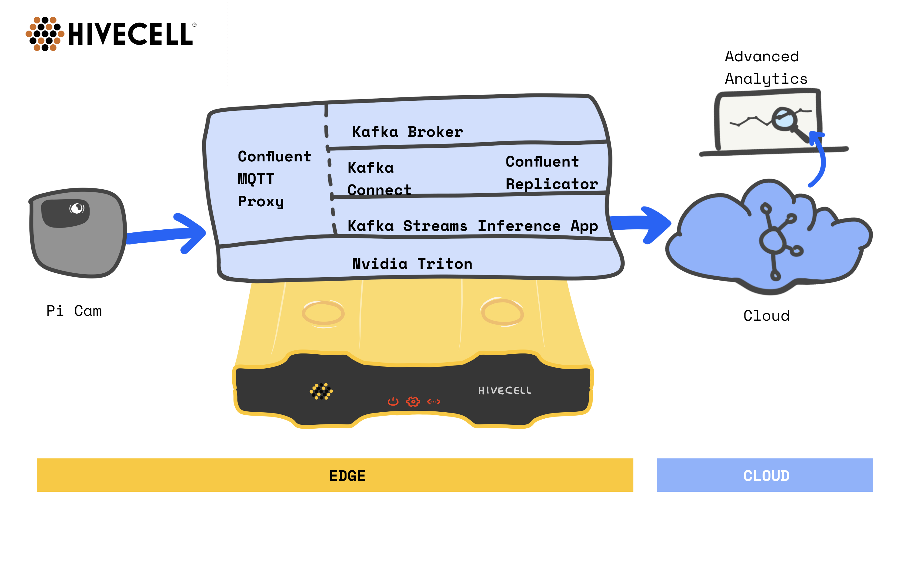

# Hivecell-KafkaStreams-DeepVision

**This repository contains examples of machine learning algorithms for computer vision tasks at Hivecell**

Lets imagine situation that we need to run object detection network in cloud. We will have tons of cameras which will send data to the cloud where ML will process all those frames.
This would require stable internet connection, high bandwidth, place to store raw data in the cloud and will cost a lot of money. 
However there is another way.

This is demo application that shows how object detection algorithms can be run at the edge and only detection result will be sent to cloud. 
Thereby reducing network bandwidth between edge and cloud.



All we need for that is to have at the edge Kafka cluster, Confluent Replicator and Confluent Mqtt Proxy.
In this demo we used RaspberryPi Camera as the source, where we runs sample script which reads raw video stream from camera, split it into frames
and using [paho-mqtt-client](https://pypi.org/project/paho-mqtt/) sends it to kafka topic on Hivecell.

On the Hivecell we have Confluent Mqtt Proxy, which listen at 1883 port and simulate MqttBroker.
Our stream read data from topic with raw frames, performs frame normalization and send it 
either to NVidia Triton over http or run build in inference on CPU.
After results are parsed application formats it to Json format and write to output topic. 
From where data through Confluent Replicator replicated to the cloud. 

On the cloud side we can now save this results for further processing. 


List of algorithms:
 - CPU
     - [SSDMobileNetV2](src/main/java/com/rickerlyman/iot/camera/infrastructure/vision/opencv/SSDMobileDetectionNetwork.java) 
     - [Ultra-Light-Fast-Generic-Face-Detector](src/main/java/com/rickerlyman/iot/camera/infrastructure/vision/opencv/ULFGFaceDetectionNetwork.java) 
     - [YOLOv3](src/main/java/com/rickerlyman/iot/camera/infrastructure/vision/opencv/YOLODetectionNetwork.java) 
 - GPU over HTTP
     - [SSDMobileNetV2](src/main/java/com/rickerlyman/iot/camera/infrastructure/vision/triton/SSDV2DetectionNetwork.java) 

**Prerequisites**:
 - 3 Hivecell (CPU intensive) instances, where Confluent stack will be deployed (3 nodes required for Confluent Replicator)
 - 1 Hivecell (GPU intensive) instance, where NVidia Triton will be deployed
 - RaspberryPi + PiCamera
 - [NVidia Triton 1.12](https://docs.nvidia.com/deeplearning/triton-inference-server/archives/triton_inference_server_1120/triton-inference-server-guide/docs/index.html)
 - [Confluent Kafka 5.4.1](https://docs.confluent.io/5.4.1/installation/installing_cp/index.html?_ga=2.188498408.1568361680.1592296905-895316610.1590138623)
 - [Confluent Replicator 5.4.1](https://docs.confluent.io/5.4.1/connect/kafka-connect-replicator/index.html)
 - [Confluent MQTT Proxy 5.4.1](https://docs.confluent.io/5.4.1/kafka-mqtt/index.html)
 - [JavaCV 1.5.3](https://github.com/bytedeco/javacv/releases/download/1.5.3/javacv-platform-1.5.3-bin.zip)
 - [DeepLearning4J 1.0.0-beta7](https://deeplearning4j.konduit.ai/getting-started/build-from-source) 
 
**To be able to run this application you need to perform next steps**:

1. At Hivecell machine download:

    For SSDM_CV algorithm:
    
    <https://github.com/cansik/deep-vision-processing/releases/download/repository/coco-labels-paper.txt>
    <https://github.com/cansik/deep-vision-processing/releases/download/repository/ssd_mobilenet_v2_coco_2018_03_29.pbtxt>
    <https://github.com/cansik/deep-vision-processing/releases/download/repository/ssd_mobilenet_v2_coco_2018_03_29.pb>
    
    For YOLO_CV algorithm:
    
    <https://github.com/cansik/deep-vision-processing/releases/download/repository/coco.names>
    <https://github.com/cansik/deep-vision-processing/releases/download/repository/yolov3.weights>
    <https://github.com/cansik/deep-vision-processing/releases/download/repository/yolov3.cfg>
    
    For ULFG_CV algorithm:
    
    <https://github.com/cansik/deep-vision-processing/releases/download/repository/version-RFB-640_simplified.onnx>
    
    For SSD_V2_TRITON algorithm only labels required (this labels should be converted to format described in step 3):
    
    <https://github.com/jkjung-avt/tensorrt_demos/blob/master/utils/ssd_classes.py> 
    
    Additional information can be found here:
    
    <https://github.com/jkjung-avt/tf_trt_models> 
    <https://github.com/jkjung-avt/tensorrt_demos>

2. coco-labels-paper.txt, coco.names and ssd_classes.py should be converted from txt|py to json and looks like this:
    ```json
        {
         "person": 0,
         "bicycle": 1,
         "car": 2,
         .
         .
         .
        }
    ```
    where value index is position in file starting from 0

3. In Kafka create two topics:
    - pi-cam
    - com.rlr.recognized-frames

4. Copy [stream_frame.py](src/main/python/stream_frame.py) script to raspberry-pi

5. Modify [default-application.conf](src/main/resources/default-application.conf) and specify `kafka.brokers` property

6. Build project and copy it to Hivecell
    ```bash 
    mvn clean package -P{profile} -Dmaven.test.skip -Djavacpp.platform=linux-arm64
    ``` 
    Profile options:
    - >local
    
   Local include all necessary dependencies
    - >arm64
   
   Arm64 expects javacv, javacv-paltform, opencv-platform, nd4j-native to be present on target machine 
    
    In case arm64 profile will be used, at Hivecell should be installed javacv, javacv-paltform, opencv-platform, nd4j-native
    please use links in Prerequisites for more information.

7. Run stream
    
    If application was built with `arm64` profile:
    
    SSDM:
    ```bash
    java -cp hivecell-kafka-iot-pi-camera-1.0-SNAPSHOT.jar:{javacv_lib_path}/* com.rickerlyman.iot.camera.Driver SSDM_CV ssdm/ssd_mobilenet_v2_coco_2018_03_29.pbtxt ssdm/ssd_mobilenet_v2_coco_2018_03_29.pb ssdm/coco-labels-paper.json
   ```
    YOLO: 
    ```bash
    java -cp hivecell-kafka-iot-pi-camera-1.0-SNAPSHOT.jar:{javacv_lib_path}/* com.rickerlyman.iot.camera.Driver YOLO_CV yolo3/yolov3.cfg yolo3/yolov3.weights yolo3/coco.names.json
   ```
    ULFG: 
    ```bash
    java -cp hivecell-kafka-iot-pi-camera-1.0-SNAPSHOT.jar:{javacv_lib_path}/* com.rickerlyman.iot.camera.Driver ULFG_CV ulfg/version-RFB-640_simplified.onnx
   ```
    SSDV2: 
    ```bash
    java -cp hivecell-kafka-iot-pi-camera-1.0-SNAPSHOT.jar:{javacv_lib_path}/* com.rickerlyman.iot.camera.Driver SSD_V2_TRITON ssd_triton/labels.json
   ```
    
    If application was built with `local` profile:
    
    SSDM: 
    ```bash
    java -cp hivecell-kafka-iot-pi-camera-1.0-SNAPSHOT.jar com.rickerlyman.iot.camera.Driver SSDM_CV ssdm/ssd_mobilenet_v2_coco_2018_03_29.pbtxt ssdm/ssd_mobilenet_v2_coco_2018_03_29.pb ssdm/coco-labels-paper.json
   ```
    YOLO: 
    ```bash
    java -cp hivecell-kafka-iot-pi-camera-1.0-SNAPSHOT.jar com.rickerlyman.iot.camera.Driver YOLO_CV yolo3/yolov3.cfg yolo3/yolov3.weights yolo3/coco.names.json
   ```
    ULFG: 
    ```bash
    java -cp hivecell-kafka-iot-pi-camera-1.0-SNAPSHOT.jar com.rickerlyman.iot.camera.Driver ULFG_CV ulfg/version-RFB-640_simplified.onnx
   ```
    SSDV2: 
    ```bash
    java -cp hivecell-kafka-iot-pi-camera-1.0-SNAPSHOT.jar com.rickerlyman.iot.camera.Driver SSD_V2_TRITON ssd_triton/labels.json
   ```

8. Run python3 stream_frame.py {resolution} {fps} {ttl} {kafka_broker} {kafka_mqtt_proxy_port} {topic}.
For best results each algorithm expects specific fps and resolution, use information below (be aware higher resolution better detection, but slower. Lower resolution opposite):
    - SSDM_CV: max 10 FPS, Jpeg, 640x480 or 400x304
    - YOLO_CV: max 8 FPS, Jpeg, 640x480 or 400x304
    - ULFG_CV: max 12 FPS, Jpeg, 640x480 or 400x304
    - SSD_V2_TRITON: max 50 FPS, Jpeg, 640x480
    - SSD_V2_TRITON: max 26 FPS, Jpeg, 1280x960
    
    Example: 
    ```bash 
    python3 stream_frame.py 640x480 30 30 {kafka_host} {kafka_mqtt_proxy_port} pi-cam
   ```